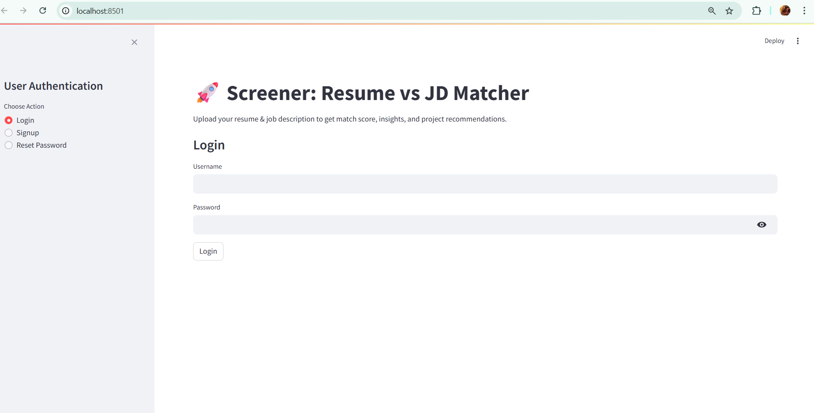
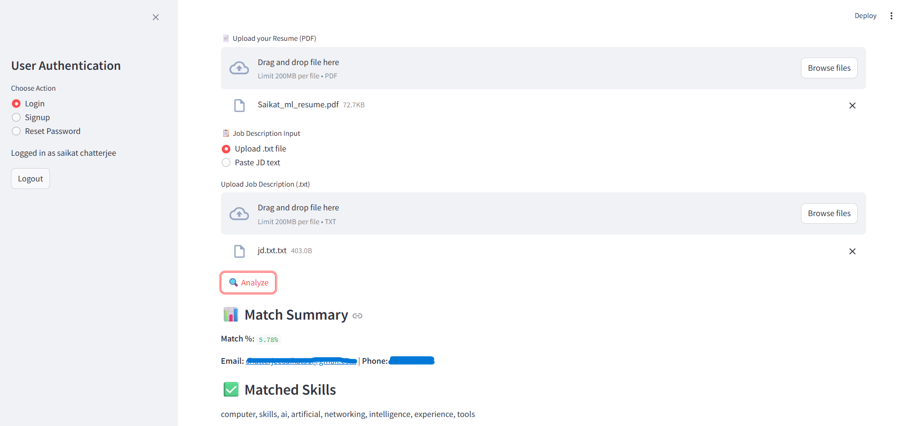

# 🚀 Resume Screener- Resume & JD Matchmaking App

[]
[](#tech-stack)

Resume screener is a smart, interactive web app that helps candidates compare their **Resume** against any **Job Description (JD)** and discover:
- ✅ Skill Match %
- 📉 Missing skills
- 💡 Recommended projects to improve alignment

This project was designed as a **personal job-seeking assistant** to impress ATS systems and interviewers — and now it's open-sourced for others to benefit too!

---

## 🌟 Features

| Capability                      | Description                                                                 |
|----------------------------------|-----------------------------------------------------------------------------|
| 📄 Resume Upload                | Upload your resume (PDF) for analysis                                      |
| 📋 JD Input                     | Paste or upload job descriptions                                           |
| 🧠 Skill Extraction             | NLP-based keyword extraction from resume and JD                            |
| 📊 Match % Calculation          | Uses TF-IDF + cosine similarity for match scoring                          |
| ❌ Missing Skills Detection     | Highlights the gaps in your resume                                         |
| 🔍 Smart Project Recommender   | Suggests tailored projects from a JSON knowledge base                      |
| 📈 Visual Insights              | Live heatmaps and gauge charts for visual understanding                    |
| 🔐 Login /Signup                | Login/Signup with reset password option


```
careercompass_project/
├── app/
│   ├── jd_parser.py          # JD keyword extractor
│   ├── matcher.py            # Match % calculator
│   ├── recommender.py        # Suggests projects based on missing skills
│   ├── resume_parser.py      # Resume keyword extractor
│   └── utils.py              # Reusable NLP helpers
│
├── assets/
│   └── project_ideas.json    # 250 curated project suggestions(sourced from web)
│
├── users.db                  # SQLite user accounts database (auto-created on first signup)
├── main.py                   # 🚀 Streamlit app entry point with login/signup/reset
├── requirements.txt          # All dependencies
├── runtime.txt               # Python version pin
├── README.md                 # This file
└── .gitignore

```
---

🔍 How It Works
1. Resume Parsing
   -Reads PDF content using PyPDF2
   -Tokenizes, removes stopwords, extracts keywords

2. JD Parsing
   -Similar NLP pipeline as resume parsing
   -Extracts important required skills and terms

3. TF-IDF + Cosine Similarity
   -Converts both keyword lists into vectors
   -Calculates match percentage

4. Project Recommendations
   -Compares missing JD skills with skills in a curated list of 250+ projects
   -Suggests relevant project ideas
5. Visualization
   -Interactive heatmap for match score.
   -Gauge chart to visualize alignment level.
---


🌐 Deployment
The app is deployed on Render at:


---


🧠 Use Cases

• ✅ Freshers or students analyzing their resume before applying

• 🎯 Mid-level devs matching with job descriptions

• 📚 Project-based learning paths based on real-world JDs

• 📈 Career counselors helping others optimize resumes


---

🧩 Possible Future Enhancements-

• 🗂 Resume repository with versioning

• 🧠 LLMs for advanced JD parsing and personalized recommendations

• 🧪 Automated resume scoring with feedback

• ☁️ Cloud storage for parsed data


## 📸 Screenshots

### 1️⃣ Login Page


### 2️⃣ Resume & JD Upload


### 3️⃣ Match Results

